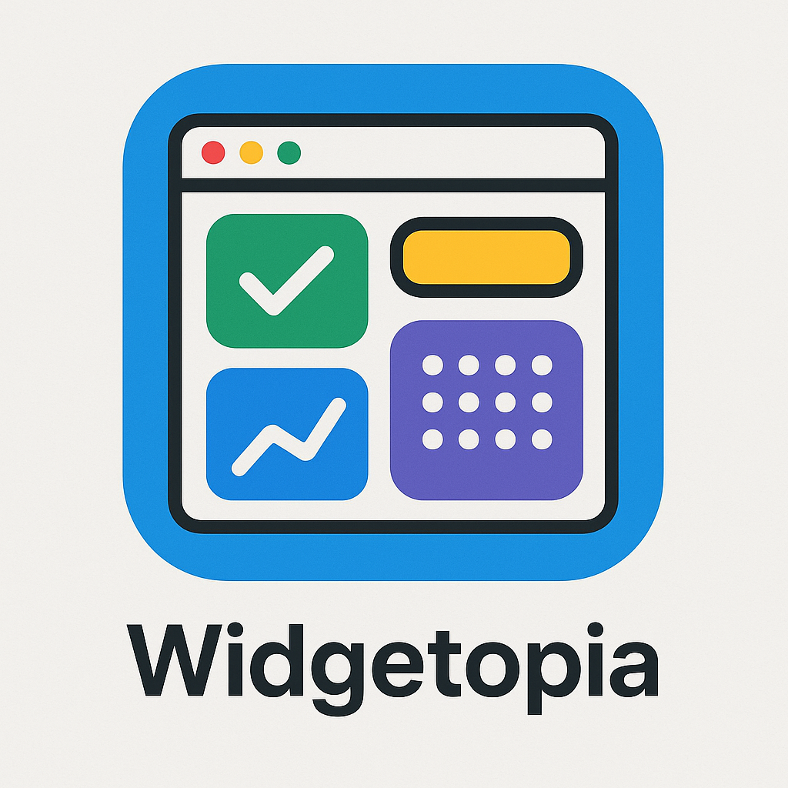

# 🌟 Widgetopia

<p align="center">
  
</p>

<p align="center">
  <b>Customize your webpage with widgets for maximum productivity 🚀</b>
</p>

<p align="center">
  
  
  
  
</p>

---

## 📑 Table of Contents

- [✨ About](#-about)  
- [🚀 Features](#-features)  
- [🛠️ Tech Stack](#️-tech-stack)  
- [📦 Getting Started](#-getting-started)  
- [📂 Project Structure](#-project-structure)  
- [🌍 Deployment](#-deployment)  
- [🤝 Contributing](#-contributing)  
- [📜 License](#-license)  
- [🔮 Future Vision](#-future-vision)  

---

## ✨ About

Widgetopia is a **Next.js + TypeScript + TailwindCSS** project that lets users transform their webpage into a **personalized productivity dashboard**.  
With pre-built widgets and full customization options, Widgetopia gives you the freedom to design a workspace that fits your workflow.

---

## 🚀 Features

- 🧩 **Pre-built Widgets** – digital clock, to-do list, notes, and more (with more coming soon).  
- 🎨 **Customizable Layout** – drag, drop, and style your widgets to make the page truly yours.  
- ⚙️ **Export Settings** – save and reuse your personalized dashboard layout.  
- 🌱 **Future Goals**:  
  - Add more widget types.  
  - Authentication & user accounts.  
  - Database integration for persistent storage.  

---

## 🛠️ Tech Stack

- [Next.js](https://nextjs.org/) – React framework for production.  
- [TypeScript](https://www.typescriptlang.org/) – Strongly typed JavaScript.  
- [Tailwind CSS](https://tailwindcss.com/) – Utility-first styling.  

---

## 📦 Getting Started

Follow these steps to run Widgetopia locally:

### 1. Clone the repo
```bash
git clone https://github.com/Vakacharla-Lokesh/Widgetopia.git
cd Widgetopia
